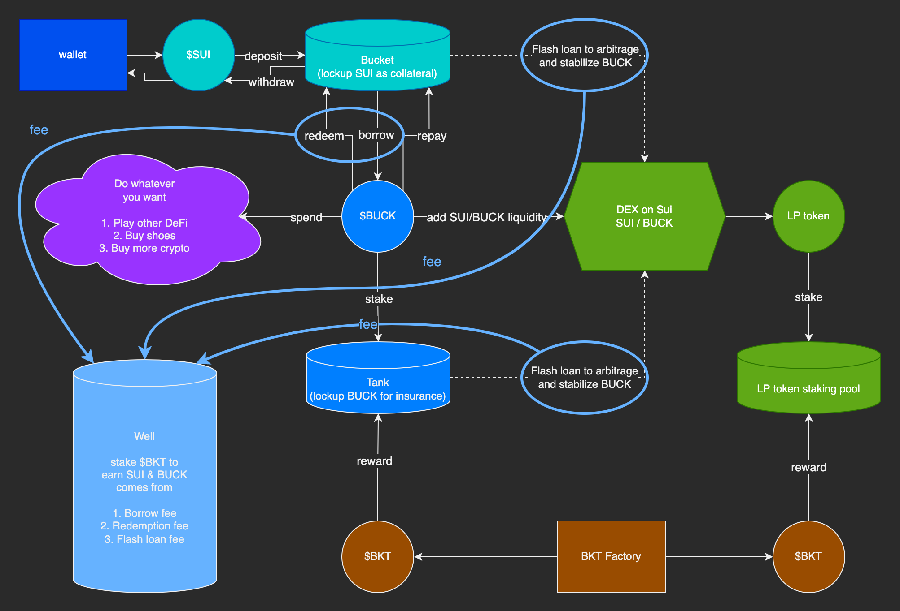

# Bucket Protocol
Zero-interest lending protocol on Sui, borrowing decentralized stable-coin against $SUI.

## Mechanism
1. Deposit $SUI as collateral and borrow $BUCK with minimal collateral ratio 115%
2. Repay with $BUCK and take back collateral in the form of $SUI
3. Redeem 1:1 value of $SUI from protocol using $BUCK
4. Deposit $BUCK to Tank to earn incentive token $BKT
5. Provide liquidity for SUI/BUCK on DEX also earn $BKT
6. Stake $BKT to share protocol revenue, coming from Borrow Fee, Redemption Fee and Flash-Loan Fee
 
## Flow chart


## FAQ
### Q: Why should I deposit $SUI and borrow $BUCK?  
Bucket Protocol enable users to extract stable value from $SUI with zero interest to pay, only a one-time borrow fee.

### Q: Why should I deposit $BUCK to the Tank?  
Bucket Protocol force the Tank to absorb bad debt. If users deposit $BUCK in Tank, they're helping protocol and make it more healthy. As the compensation of taking this risk, Bucket Protocol will reward Tank depositors with $BKT.

### Q: Why should I add liquidity to SUI/BUCK on DEX and stake the LP token?  
Bucket Protocol is fully decentralized, which rely on liquidators to liquidate debt with Collateral Ratio lower than 115%. Adding SUI/BUCK liquidity on DEX, will create a better environment with lower slippage for liquidators. As the compensation of taking this risk, Bucket Protocol will reward liquidity providers with $BKT.

### Q: What can I do with $BKT?  
$BKT serve as an incentive token in Bucket Protocol. Anyone who makes the protocol a better place should take part of the revenue from the protocol, which comes from three ways: Borrow Fee, Redemption Fee and Flash-Loan Fee. Staking $BKT allow users to share these profits, which are in the form of $SUI and $BUCK, and motivate them to keep helping the Bucket Protocol as well as the whole DeFi ecosystem on Sui.

## Testnet
Package ID
```
0x74dfd5e2cac60a19316884a3a4cdc88f7a946852f9d7de6a3846afe7de539994
```
Bucket Protocol ID
```
0xa7abebdd5042e01d5f4143ea279bb6b8752524c2b906d98e1d1a65a1a138d5bd
```

## Modules
#### buck
1. Assemble other modules
2. Burn and mint $BUCK
#### bucket
1. Handle collateral when borrow, repay and redeem
2. Sort debtor positions by collateral ratio
#### bottle
1. Record debtor positions
#### tank
1. Hold deposited $BUCK for liquidation
2. Distribute collateral to $BUCK depositers after liquidation
#### bkt
1. $BKT token distribution 
2. Reward tank depositors and SUI/BUCK liquidity providers with $BKT
#### well
1. Collect fee from borrowing, redemption and flash loan
2. Distribute fee to $BKT staker
